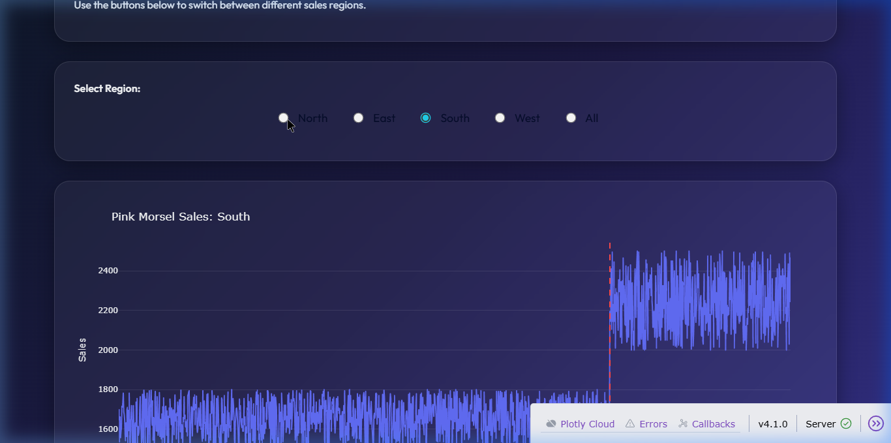
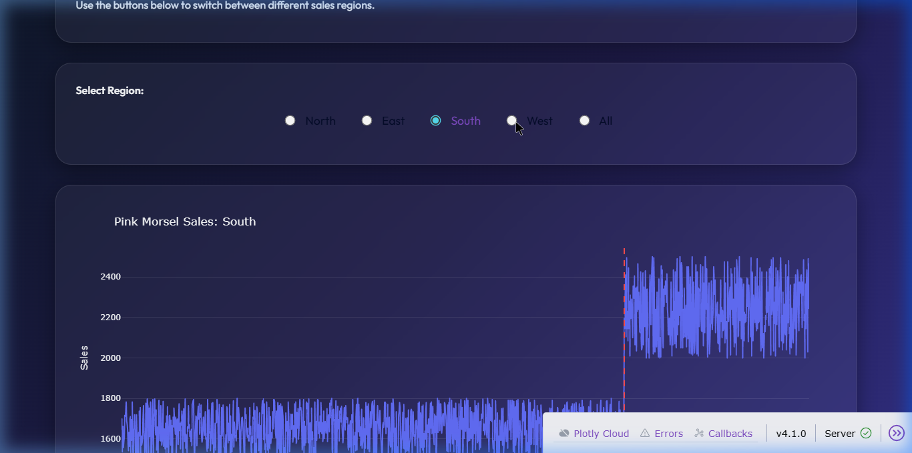
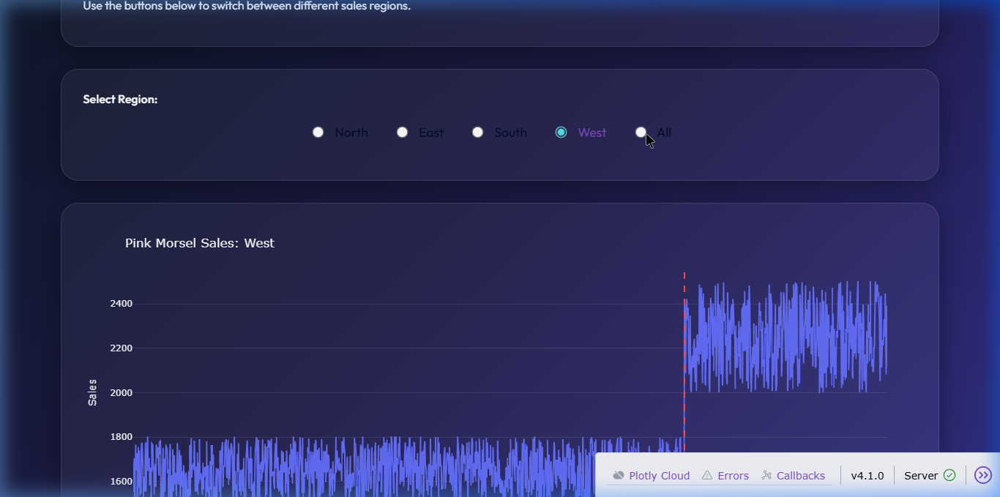

#  Pink Morsel Sales Visualizer
Hello Friend,
Welcome to the **Soul Foods Sales Dashboard**! This project was built to help the Soul Foods team understand how their sales were affected by the "Pink Morsel" price increase on **January 15th, 2021**.


---

##  What is this Project? (For Beginners)
Imagine you have a giant spreadsheet with thousands of rows of sales data. It's hard to see any patterns, right? 
This project takes that data and "paints a picture" for you. It uses a concept called **Data Visualization** to turn numbers into a line chart, allowing you to see exactly when sales went up or down.

---


##  How to Use the Dashboard
Once the app is running, you can interact with it like a pro!

1.  **Look at the Header:** You'll see a premium, frosted-glass title at the top.
2.  **Pick a Region:** Use the **Region Picker** (Radio Buttons) at the bottom to filter the data.
3.  **Analyze the Chart:** 
    - The **Blue Line** shows total sales over time.
    - The **Red Dashed Line** marks the price increase date 
    - Notice what happens to the blue line after the red line!

### Interactive Feature Showcase:
````carousel

<!-- slide -->

<!-- slide -->

````

---

## 🤖 Automated Quality Checks
We want to make sure the app never breaks. That's why we have a **Test Suite**! These are robot scripts that check the app for us.


